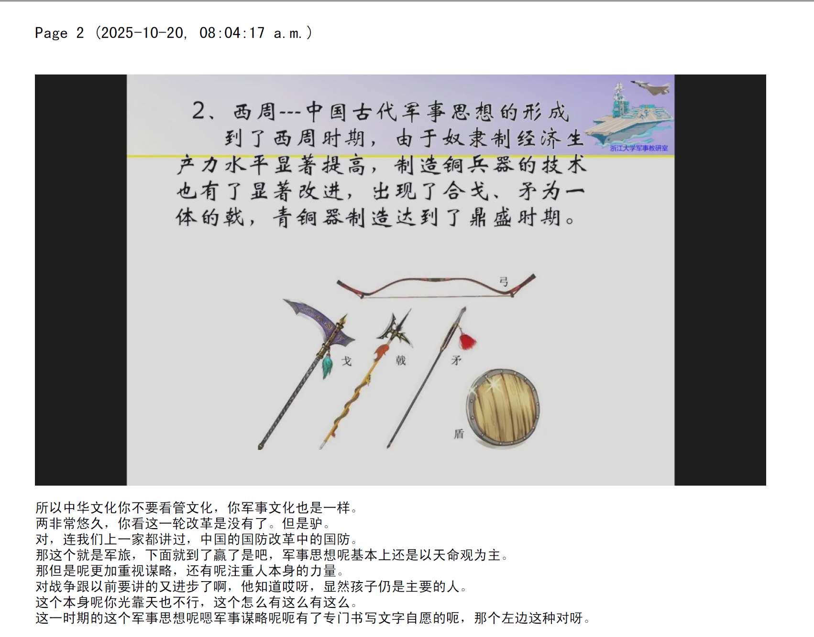
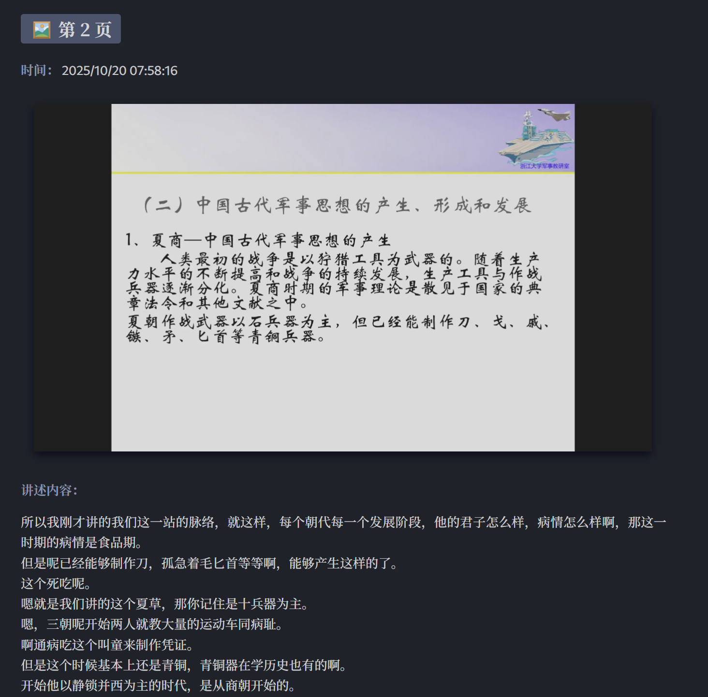

### 作为一个热爱写电子笔记的好少年，却常常因为 思维过于活跃/看了一眼手机/被床黏住 等不可抗力而导致笔记缺失，对此我十分苦恼。如果你也有这样的烦恼，不用担心，<del>你的强来了</del>，现在登场的是智云课堂笔记助手

###  一键式下载PDF/Markdown笔记（超好用）

### PDF格式截图

### Markdown格式截图（主题是lapis dark）

### 你需要准备什么：chrome浏览器，科学上网技能（最好用过github）

下面是具体操作

## 为智云课堂开发的chrome插件

**声明：本插件仅为学习交流使用，请勿用于商业途径。插件基于chrome扩展架构（MV3）开发，并且还有很多待完善的地方，请见谅**

<del>更适合zju宝宝的体质</del>

* **用途：自动将课堂PPT和讲解字幕导出为PDF文档或者Markdown文件（含图片的压缩包）** 
* 特点：  
    1. 每页pdf或者markdown有页眉（具体时间），页脚（第几页），以及ppt对应的字幕  
    2. 添加重复图像识别，自动过滤重复ppt，参数可调，详细见**For Developers**  
    3. 导出的PDF文件或者Markdown文件有课程标题和时间，方便查看 

##  安装插件

1. 进入我的仓库https://github.com/Auspiow/zhiyun-extension

2. 下载插件压缩包

    

3. 解压缩

   

4. 打开谷歌浏览器（推荐），进入chrome://extensions

   

5. 打开开发者模式并选中解压后的文件夹（分为两步）

   

6. 然后可以看到安装了插件，记得检查右下角插件是否打开

   

7. 推出后在浏览器的右上角可看到一个拼图形状的按钮

   

8. 点一下图钉按钮可以固定插件

   

   

## 具体使用说明

进入智云课堂页面之后再点击插件会出现弹窗，按照流程点击就会自动下载

注意是进入具体的页面之后再点击插件：

然后点击插件会出现按钮，按钮点击一次之后没有反应需要刷新一下

出现这个标志才算结束，下载列表会有pdf文件（或者是包含Markdown的压缩包），如果没有的话刷新后按照上面的流程走一遍

## For Developers

content.js是主要的内容脚本，里面的isSameImage是检测重复ppt的，参数threshold(0,1)用于判断两张ppt的近似程度，可以手动调整之后再更新插件以达到个性化的目的。数值越大，相似的ppt越多（过滤的越少）；数值越小，相似的ppt越少（过滤的越多）。

### 你的star是我前进的动力