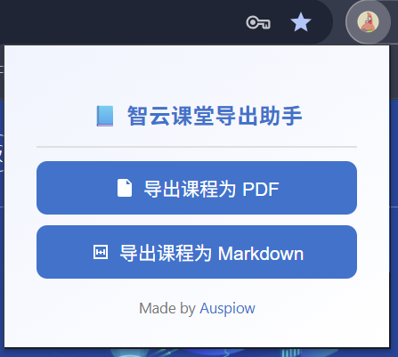
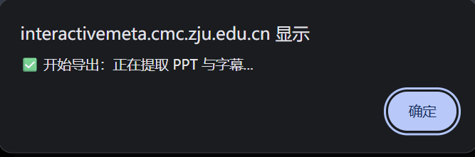
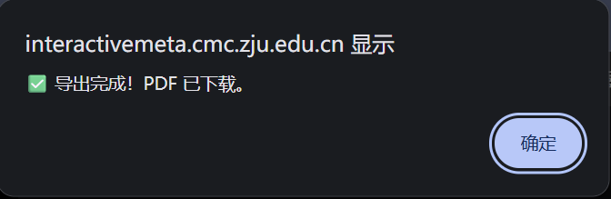

## 为智云课堂开发的chrome插件 by Auspiow

**声明：本插件仅为学习交流使用，请勿用于商业途径。并且还有很多待完善的地方，请见谅**

<del>更适合zju宝宝的体质</del>

* **用途：自动将课堂PPT和讲解字幕导出为PDF文档**  
* 优化：  
    1. 每页pdf有页眉（时间），页脚（第几页），以及ppt对应时间的字幕  
    2. 添加重复图像识别，自动过滤重复ppt，参数可调，详细见**For Developers**  
    3. 导出的PDF文件有课程标题和时间  

这时候就有人问了：**帅哥帅哥**我为什么不直接用智云课堂里可以下载的ppt和字幕呢？

于是我假装思考许久，缓缓给出答案：

1. 智云课堂下载的ppt有很多重复，删起来太麻烦
2. 不会真的有人下载字幕来看的，ppt配合字幕才是真神
3. 导出的ppt没有时间，不易快速浏览和定位

##  安装插件

1. 进入我的仓库https://github.com/Auspiow/zhiyun-extension

2. 下载插件压缩包

   

3. 解压缩

   

4. 打开谷歌浏览器（推荐），进入chrome://extensions

   

5. 打开开发者模式并选中解压后的文件夹（分为两步）

   

6. 然后可以看到安装了插件，记得检查右下角插件是否打开

   

7. 推出后在浏览器的右上角可看到一个拼图形状的按钮

   

8. 点一下图钉按钮可以固定插件

   

   

## 具体使用

进入智云课堂页面之后再点击插件会出现弹窗，按照流程点击就会自动下载

## For Developers

content.js里面isSameImage是检测重复ppt的，里面的参数threshold(0,1)用于判断两张ppt的近似程度，可以手动调整之后再更新插件以达到个性化的目的。数值越大，相似的ppt越多（过滤的越少）；数值越小，相似的ppt越少（过滤的越多）。